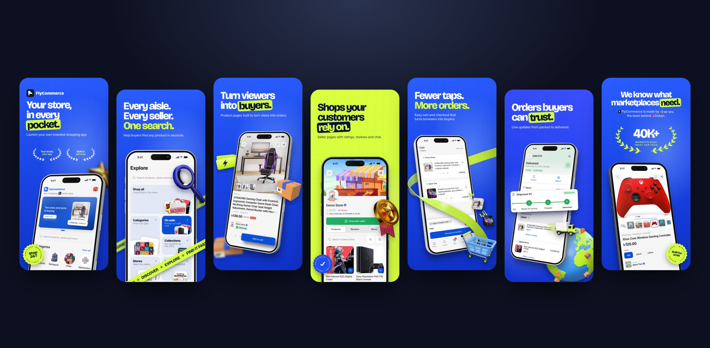
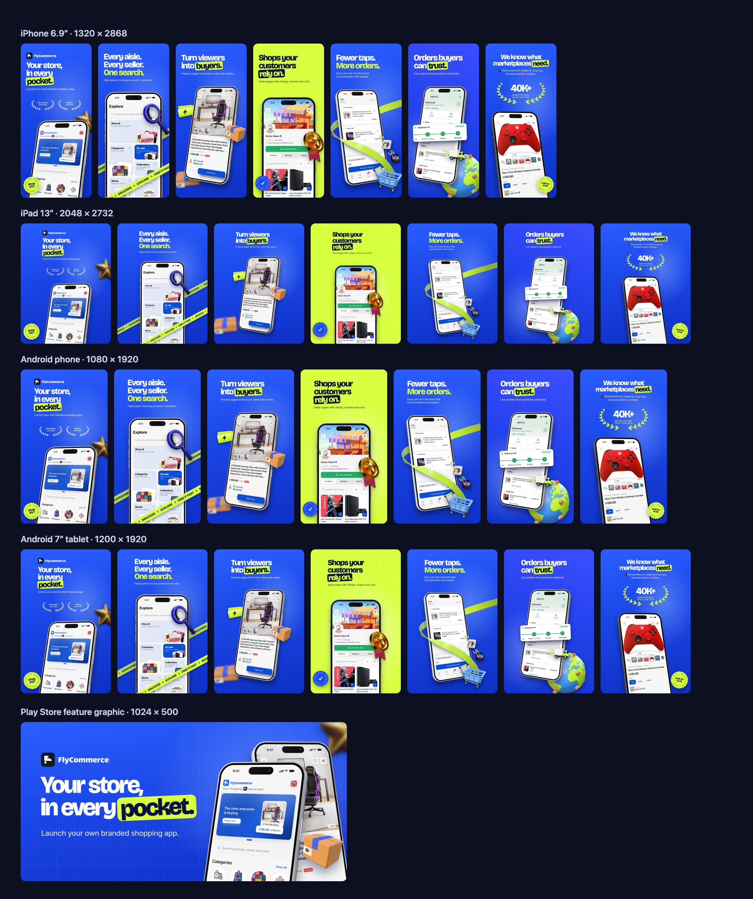
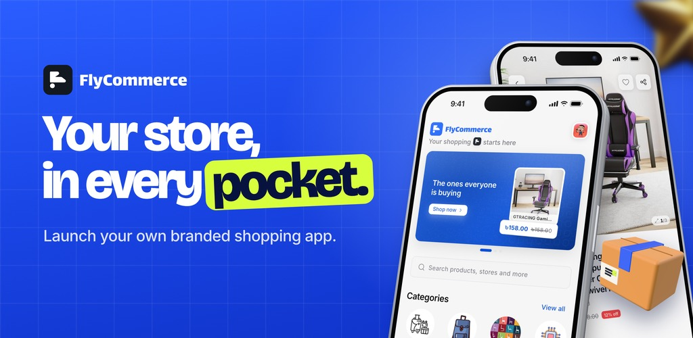

<div align="center">

# Store Screenshot Studio

**Bold App Store and Google Play screenshots, made from your own app screens.**

An agent skill for Claude Code and other AI coding agents.
You give it your screenshots. It gives you a finished, store-ready set.

[](LICENSE)
[](#install)
[](https://agentskills.io)
[](#what-you-get)

**[Install](#install)** · **[Use it](#use-it)** · **[How it works](#how-it-works)** · **[What you get](#what-you-get)** · **[FAQ](#faq)**



<sub>A real set made with this skill for the FlyCommerce shopping app.</sub>

</div>

---

## Why use it

Most screenshot tools give you a template. The result looks like every other app in the store.

This skill works like a designer. It reads about your app, picks your best screens and writes short headlines.
It builds colours from your brand. Then it invents four concepts from your app's own world, and you choose.
The same skill gives every app a different result, built from your context, your brand and your references.

- **Real 3D phone mockups.** Every screen sits in a sharp iPhone Pro frame with depth, buttons and a shadow.
- **Your brand, not a theme.** Colours come from your logo. 3D props are made in your colours.
- **No wasted rounds.** You approve the screens, the words and the colours before any design starts.
- **Every store size at once.** One design becomes iPhone, iPad, Android phone and Android tablet sets.
- **Store-safe text.** It flags fake claims like "#1" or "best" and checks every line before export.

## Install

You need **Node.js 20 or newer** and **Google Chrome**.
The first run downloads a small renderer, so it needs internet once.

### Claude Code (recommended)

Run these two commands inside Claude Code:

```
/plugin marketplace add 7ANV1R/Store-Screenshot-Studio
/plugin install store-screenshot-studio@store-screenshot-studio
```

### Other agents (Codex, Cursor and more)

```
npx skills add 7ANV1R/Store-Screenshot-Studio
```

### Manual install

Copy the `skills/store-screenshot-studio` folder into one of these places:

- `your-project/.claude/skills/` to use it in one project
- `~/.claude/skills/` to use it in all projects

## Use it

Open your app project in Claude Code. Then ask in your own words. For example:

> Make App Store and Play Store screenshots for my app.
> The website is https://example.com and the screenshots are in ~/Desktop/my-screens.

You can also start it directly with `/store-screenshot-studio`.

Everything goes into a `store-screenshots` folder in your project:

```
store-screenshots/
├── plan/storyboard.png      the story and words you approve
├── plan/palettes.png        colour choices made from your brand
├── rounds/round-1/          the four concepts (every round is kept)
└── final/                   your store-ready images, one folder per size
```

### Tips for the best result

- Use raw screenshots from one device size, with no phone frame. Simulator captures are fine.
- Use real-looking data in your app. Test names and "100%" everywhere look fake in a store listing.
- Share your logo as an SVG file. It gives the most exact brand colours.
- Have screenshot designs you love? Share the links. The skill follows your taste first.

## How it works

1. **You share your app.** Tell it what the app does, or give it a link to your website.
   Point it to your screenshots. Add your logo if you have one.
   If something is missing, it asks you.
2. **It plans the story.** It picks the 5 to 7 strongest screens and writes a headline for each.
   You see one storyboard image. You approve it, or you change it.
3. **You pick the colours.** It reads your brand colours and shows 9 palettes.
   You choose up to four.
4. **Round 1: four concepts.** You get four complete sets.
   Each one is a different idea, made from your app's world, your brand and your references.
5. **You refine.** Tell it what to change, slide by slide.
   It changes only what you ask. It keeps every earlier round, so you can go back.
6. **You say "generate".** It makes every store size and the feature graphic.

## What you get

| Output | Size (pixels) |
|---|---|
| iPhone 6.9" screenshots | 1320 × 2868 |
| iPad 13" screenshots | 2048 × 2732 |
| Android phone screenshots | 1080 × 1920 |
| Android 7" tablet screenshots | 1200 × 1920 |
| Google Play feature graphic | 1024 × 500 |

<details>
<summary><b>See the full example set in every size</b></summary>
<br>

</details>

<p align="center">

<br><sub>The Google Play feature graphic from the same set.</sub>
</p>

## What is inside

```
skills/store-screenshot-studio/
├── SKILL.md         the step-by-step workflow the agent follows
├── references/      design taste, copy rules, layouts, store rules
├── scripts/         the renderer: phone mockups, palettes, 3D props, all store sizes
└── assets/          a parts demo and the feature graphic template
```

The design taste comes from a real project. It went through 11 review rounds with a demanding client.
Every rule records what the client approved or rejected, and why.
Read it in [`references/design-taste.md`](skills/store-screenshot-studio/references/design-taste.md).

## FAQ

<details>
<summary><b>Does it work for any kind of app or game?</b></summary>
<br>
Yes. A shopping app, a travel app, a calculator, a fitness tracker or a game all work.
The ideas come from your app's own world. A travel app might get boarding passes and stamps.
A calculator might get receipt tape and giant numbers. A game gets its own characters and world.
Landscape game screenshots work too.
</details>

<details>
<summary><b>Will my screenshots look like everyone else's?</b></summary>
<br>
There is no fixed template. The skill builds each concept from your app, your brand colours and your references.
The four concepts in a round must also look different from each other.
The FlyCommerce set above is one example of the quality level, not a style you will get.
</details>

<details>
<summary><b>Can I bring my own style?</b></summary>
<br>
Yes. Share links or images you love, and a few mood words. Your references lead the design.
</details>

<details>
<summary><b>Do I need design skills?</b></summary>
<br>
No. You answer a few simple questions and pick from images. The skill does the design work.
</details>

<details>
<summary><b>Are the 3D objects free to use?</b></summary>
<br>
Yes. The skill makes them on your computer, in your brand colours. You can also use your own.
</details>

<details>
<summary><b>Why is the phone an iPhone on the Android images too?</b></summary>
<br>
One look on every store keeps your brand the same everywhere. Ask the agent if you need an Android frame.
</details>

## License

[MIT](LICENSE). Use it for personal and commercial projects.
